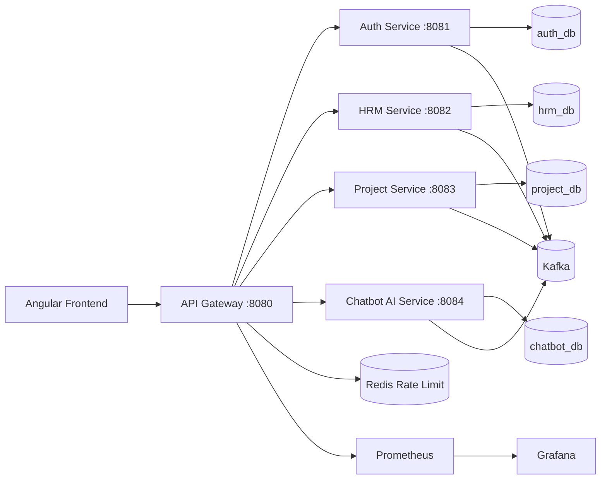

# MyStartUp — Microservices HRM + Project Management Platform

MyStartUp is an Employee Management System (HRM + Project/Task Management) migrated from a Spring Boot monolith to a **microservices architecture** while preserving existing business rules, entities, and the Angular UI.

## Architecture overview



### Microservices

| Service | Port | Responsibility |
|---------|------|----------------|
| **api-gateway** | 8080 | Single entry point, JWT validation, routing, rate limiting |
| **auth-service** | 8081 | Auth, JWT/refresh, users, roles, teams, employee profiles |
| **hrm-service** | 8082 | Leaves, payroll, documents, skills, training, evaluations, notifications, reports |
| **project-service** | 8083 | Projects, tasks, validation workflow, statistics |
| **chatbot-service** | 8084 | Role-aware AI assistant (Ollama) |

## Communication

- **REST**: synchronous calls (gateway → services, chatbot → services)
- **Kafka** (pub/sub): leave approved, task validated, project created, notifications, chatbot logs, training reminders

## Quick start (Docker Compose)

1. Copy environment variables:

```bash
cp .env.example .env
# set JWT_SECRET; pull Ollama model (see chatbot section below)
```

2. Start platform:

```bash
docker compose up --build
```

3. Open:

- Frontend: `cd frontend && npm start` → http://localhost:4200
- API Gateway: http://localhost:8080
- Swagger per service: `http://localhost:8081/swagger-ui.html` (auth), `8082` (hrm), `8083` (project), `8084` (chatbot)
- Prometheus: http://localhost:9090
- Grafana: http://localhost:3000

## Local development (without Docker)

### Prerequisites

- Java 17, Maven 3.9+
- PostgreSQL, Kafka, Redis
- Node 20+ (frontend)
- `OLLAMA_MODEL` for chatbot (default `llama3.2:1b`; pull with `ollama pull` in the Ollama container)

### Databases

Docker Compose runs `infra/postgres/init-databases.sql` and Hibernate creates tables on first service start.

After services are up, apply the minimal seed:

```powershell
.\infra\postgres\seed\apply-seed.ps1
```

Logins: `admin`, `hr`, `manager`, `employee` — password `password`. See `infra/postgres/README.md`.

### Build microservices

```bash
cd microservices
mvn clean package -DskipTests
```

Run each service (separate terminals):

```bash
java -jar auth-service/target/auth-service-1.0.0-SNAPSHOT.jar
java -jar hrm-service/target/hrm-service-1.0.0-SNAPSHOT.jar
java -jar project-service/target/project-service-1.0.0-SNAPSHOT.jar
java -jar chatbot-service/target/chatbot-service-1.0.0-SNAPSHOT.jar
java -jar api-gateway/target/api-gateway-1.0.0-SNAPSHOT.jar
```

### Frontend

```bash
cd frontend
npm install
npm start
```

The Angular app calls the gateway at `http://localhost:8080/api` (see `frontend/src/environments/environment.ts`).

## Kubernetes (Minikube)

```bash
minikube start
kubectl apply -f k8s/configmap.yaml
kubectl apply -f k8s/secrets.yaml
kubectl apply -f k8s/
minikube service api-gateway
```

Build and load images into Minikube before deploying.

## Security

- JWT access + refresh tokens (auth-service)
- HttpOnly cookies on login/refresh
- Gateway validates JWT and forwards `X-User-*` headers
- Role-based access preserved from monolith service rules

## Chatbot

- Integrated UI: `/chatbot`
- Uses **real data** fetched from microservices based on role
- Prompt structure: System + Context + Question
- Run Ollama locally or via Docker Compose; pull the configured model before using the chatbot

## Testing

```bash
cd microservices
mvn test
```

- JUnit 5 + Mockito unit tests (example: `AuthServiceImplTest`)
- BDD feature files under `*/src/test/resources/features/`
- Integration tests: extend with `@SpringBootTest` + Testcontainers (Kafka, PostgreSQL)

## Documentation

See `docs/` for:

- Architecture, microservices, class, sequence, and use-case diagrams
- API documentation index

## Preserved business rules

- Task validated progress floor
- Team restrictions for task assignment
- Project assignment rules
- All HRM modules: users, teams, projects, tasks, notifications, leaves, payroll, documents, skills, trainings, dashboards

## PFA CDC compliance checklist

| Requirement | Status |
|-------------|--------|
| Database per service (scalar FKs, no cross-service JPA) | Implemented — see `infra/postgres/` |
| OpenFeign synchronous calls | Implemented in HRM + Project + Chatbot |
| Kafka async events + consumers | Implemented |
| Swagger on services | springdoc enabled; annotate controllers incrementally |
| Tests + JaCoCo | Unit tests added; run `mvn verify` for reports |
| CI/CD GitHub Actions | `.github/workflows/ci-cd.yml` |
| Docker + healthchecks | `docker-compose.yml` |
| Kubernetes | `k8s/` manifests + ingress |
| Prometheus + Grafana | `monitoring/` |
| Chatbot Ollama + role context | `chatbot-service` |
| SVG architecture diagrams | `docs/diagrams/*.svg` |

## Project structure

```
MyStartUp/
├── microservices/           # Microservices platform
│   ├── api-gateway/
│   ├── auth-service/
│   ├── hrm-service/
│   ├── project-service/
│   ├── chatbot-service/
│   └── common-lib/
├── frontend/                # Angular 20 SPA
├── docker-compose.yml
├── k8s/
├── monitoring/
├── infra/
└── docs/
```
