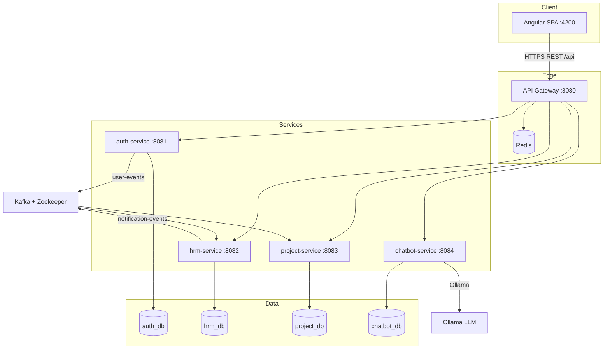
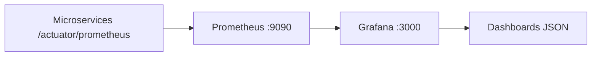
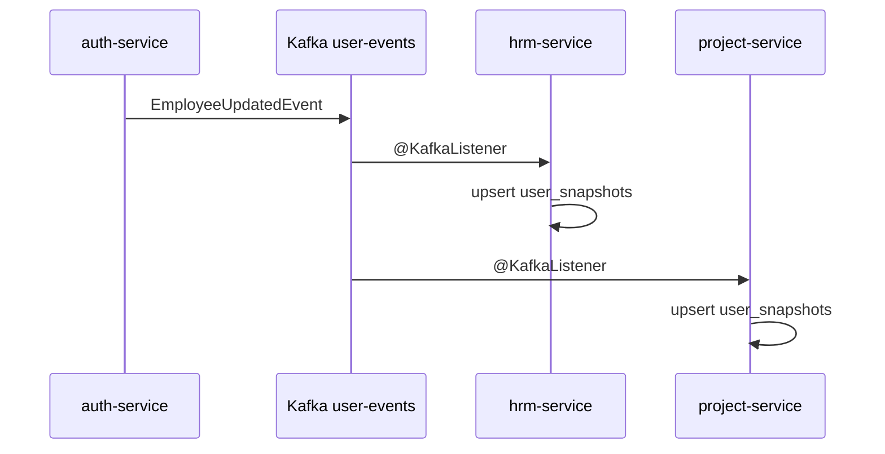

# MyStartUp PFA — Technical Report

**Project:** Enterprise HR & project management platform  
**Stack:** Spring Boot 3.3 microservices, Angular 20, PostgreSQL, Kafka, Redis, Docker, Kubernetes, Prometheus, Grafana  
**Repository:** `MyStartUp_PFA`

---

## Table of contents

1. [Global Architecture](#1-global-architecture)
2. [Technologies Used](#2-technologies-used)
3. [Microservices Analysis](#3-microservices-analysis)
4. [Class-by-Class Analysis](#4-class-by-class-analysis)
5. [Annotation Reference](#5-annotation-reference)
6. [Frontend Analysis](#6-frontend-analysis)
7. [Database Documentation](#7-database-documentation)
8. [Kafka Documentation](#8-kafka-documentation)
9. [Redis Documentation](#9-redis-documentation)
10. [Monitoring Documentation](#10-monitoring-documentation)
11. [Docker Documentation](#11-docker-documentation)
12. [Kubernetes Documentation](#12-kubernetes-documentation)
13. [API Documentation](#13-api-documentation)
14. [Testing, CI/CD, and quality](#14-testing-cicd-and-quality)

Appendices: [CLASS_REFERENCE](./appendix/CLASS_REFERENCE.md) · [INTERVIEW_PREP](./appendix/INTERVIEW_PREP.md) · [ORAL_DEFENSE](./appendix/ORAL_DEFENSE.md)

---

## 1. Global Architecture

### 1.1 Overall architecture

MyStartUp follows a **microservices architecture** with a single **API Gateway** entry point, an **Angular SPA** frontend, four **domain databases** (PostgreSQL), **Kafka** for asynchronous integration, and **Redis** for gateway rate limiting. Observability uses **Prometheus** + **Grafana**.



### 1.2 Microservices architecture

| Service | Port | Database | Responsibility |
|---------|------|----------|----------------|
| **api-gateway** | 8080 | — | Routing, CORS, JWT validation, rate limiting |
| **auth-service** | 8081 | `auth_db` | Authentication, users, teams, employee profiles |
| **hrm-service** | 8082 | `hrm_db` | Leaves, payroll, documents, skills, training, evaluations, notifications, reports |
| **project-service** | 8083 | `project_db` | Projects and tasks |
| **chatbot-service** | 8084 | `chatbot_db` | AI assistant (Ollama), chat history |
| **common-lib** | — | — | Shared DTOs, JWT helper, Kafka event types |

Each business service is an independent Maven module with its own JAR, configuration, and schema.

### 1.3 Communication flow

**Synchronous (HTTP):**

- Browser → Gateway → target service (JWT in `Authorization: Bearer`).
- Gateway adds headers: `X-User-Name`, `X-User-Role`, `X-User-Id`.
- **OpenFeign:** `auth-service` → `project-service` (`has-active-tasks` on user delete).
- **OpenFeign:** `hrm-service` / `project-service` → `auth-service` (user/team summaries).
- **RestClient:** `chatbot-service` → auth/hrm/project (context for LLM prompts).

**Asynchronous (Kafka):**

- `user-events`: auth publishes; hrm + project consume → `user_snapshots`.
- `notification-events`: hrm/project publish; hrm consumes → persist notifications.
- `leave-events`, `task-events`, `project-events`, `chatbot-conversation-logs`: published; no in-repo consumers (extensibility).

### 1.4 Frontend → backend flow

1. User opens Angular app (`http://localhost:4200`).
2. Login: `POST /api/auth/login` → JWT access + refresh tokens stored (localStorage / cookies per config).
3. `jwt.interceptor` attaches Bearer token to all API calls.
4. All calls target `apiBaseUrl` = `http://localhost:8080/api` (gateway).
5. Gateway routes by path prefix to the correct microservice.
6. Role-based routes (`authGuard` + `roles` in route data) hide unauthorized UI; backend enforces again via `SecurityConfig`.

### 1.5 Database architecture

**Database-per-service** pattern:

- No cross-database JPA joins.
- Foreign keys to users are **scalar** `user_id` / snapshots in HRM and Project.
- `user_snapshots` denormalized copy synced via Kafka or SQL seed (`dblink`).
- Schema created by **Hibernate** `ddl-auto=update` on startup.
- Bootstrap: `infra/postgres/init-databases.sql` + optional `apply-seed.ps1`.

### 1.6 Monitoring architecture



Each service exposes Micrometer metrics at `/actuator/prometheus`. Prometheus scrapes every 15s. Grafana provisions Prometheus datasource and JSON dashboards.

### 1.7 Deployment architecture

| Environment | Mechanism | Notes |
|-------------|-----------|-------|
| **Local dev** | `docker compose up` | Postgres, Kafka, Redis, all services, Prometheus, Grafana |
| **Kubernetes** | `k8s/*.yaml` | Deployments + ClusterIP/NodePort + Ingress to gateway |
| **CI** | `.github/workflows/ci-cd.yml` | Builds `microservices/` with Maven |

---

## 2. Technologies Used

Summary table; each technology includes rationale, problem solved, usage location, config files, startup role, and benefits.

| Technology | Why chosen | Problem solved | Where used | Key config | Startup order | Advantages |
|------------|------------|------------------|------------|------------|---------------|------------|
| **Spring Boot 3.3** | Standard Java enterprise stack | Auto-config, embedded server, ecosystem | All microservices | `application.yml`, `pom.xml` | After Postgres/Kafka | Fast development, production-ready |
| **Spring Security** | Industry-standard authz | Authentication & authorization | auth, hrm, project, chatbot | `SecurityConfig.java` | With each service | Centralized security model |
| **Spring Cloud Gateway** | Reactive edge router | Single entry, routing, filters | api-gateway | `api-gateway/.../application.yml` | After downstream services | Decouples clients from topology |
| **JWT** | Stateless API auth | Scalable token-based sessions | common-lib `SharedJwtService`, filters | `app.jwt.secret`, expiration | On login | No server-side session store per request |
| **PostgreSQL 16** | Reliable RDBMS | Persistent structured data | 4 databases | `SPRING_DATASOURCE_*` | Before services | ACID, SQL tooling |
| **Kafka** | Event streaming | Async user sync & notifications | auth, hrm, project, chatbot | `KAFKA_BOOTSTRAP_SERVERS` | After Zookeeper | Loose coupling |
| **Zookeeper** | Kafka dependency | Cluster coordination | docker-compose / k8s | `ZOOKEEPER_CLIENT_PORT` | Before Kafka | Required by Confluent images |
| **Redis 7** | In-memory store | Gateway rate limiter tokens | api-gateway only | `REDIS_HOST`, `REDIS_PORT` | Before gateway | Protects backend from abuse |
| **Docker** | Container packaging | Reproducible runtime | All services | `Dockerfile.runtime` | — | Dev/prod parity |
| **Docker Compose** | Local orchestration | Multi-container stack | `docker-compose.yml` | volumes, env | postgres → kafka → services | One-command environment |
| **Kubernetes** | Production orchestration | Scaling, service discovery | `k8s/` | ConfigMap, Secrets | Per manifest order | Cloud-native deployment |
| **Prometheus** | Metrics TSDB | Scraping & alerting base | `monitoring/prometheus/` | `prometheus.yml` | With stack | Standard cloud monitoring |
| **Grafana** | Visualization | Dashboards for ops | `monitoring/grafana/provisioning/` | datasources, dashboards | After Prometheus | Human-readable metrics |
| **Angular 20** | SPA framework | Rich HR UI | `frontend/` | `angular.json`, environments | Independent (`ng serve`) | Components, routing, i18n |
| **TypeScript** | Typed JavaScript | Safer frontend code | All `.ts` files | `tsconfig.json` | Compile with Angular | Fewer runtime errors |
| **Maven** | Java build | Multi-module builds | `microservices/pom.xml` | profiles, modules | `mvn package` in Docker build | Dependency management |

Detailed Q&A for professors: [appendix/INTERVIEW_PREP.md](./appendix/INTERVIEW_PREP.md).

---

## 3. Microservices Analysis

### 3.1 auth-service (8081)

| Aspect | Detail |
|--------|--------|
| **Purpose** | Identity, JWT issuance, user/team/profile CRUD |
| **Database** | `auth_db` |
| **APIs** | `/api/auth/*`, `/api/users/*`, `/api/teams/*`, `/api/employee-profiles` |
| **Kafka** | Producer: `user-events` (`EmployeeUpdatedEvent`, `UserDeletedEvent`); startup sync via `UserSnapshotSyncPublisher` |
| **Redis** | None |
| **Security** | `JwtAuthenticationFilter`, `SecurityConfig`, `AuditLoggingFilter`, BCrypt passwords, refresh tokens |
| **Dependencies** | Feign → project-service; Kafka; optional mail (legacy properties) |

### 3.2 hrm-service (8082)

| Aspect | Detail |
|--------|--------|
| **Purpose** | HR operations: leave, payroll, documents, skills, training, evaluations, notifications, reports |
| **Database** | `hrm_db` |
| **APIs** | `/api/leaves`, `/api/payroll`, `/api/documents`, `/api/skills`, `/api/employee-skills`, `/api/trainings`, `/api/evaluations`, `/api/notifications`, `/api/reports` |
| **Kafka** | Consumer: `user-events`, `notification-events`; Producer: `leave-events`, `notification-events`, `training-reminders` |
| **Redis** | None |
| **Security** | JWT via `SharedJwtService`; role rules (ADMIN read-only on mutations) |
| **Dependencies** | Feign → auth-service; file uploads volume `hrm-uploads` |

### 3.3 project-service (8083)

| Aspect | Detail |
|--------|--------|
| **Purpose** | Project and task lifecycle |
| **Database** | `project_db` |
| **APIs** | `/api/projects`, `/api/tasks`, internal `/api/internal/users/{id}/has-active-tasks` |
| **Kafka** | Consumer: `user-events`; Producer: `task-events`, `project-events`, `notification-events` |
| **Redis** | None |
| **Security** | JWT; permits `/api/internal/**` for service-to-service |
| **Dependencies** | Feign → auth-service |

### 3.4 chatbot-service (8084)

| Aspect | Detail |
|--------|--------|
| **Purpose** | Natural-language HR assistant using Ollama |
| **Database** | `chatbot_db` (`chat_messages`) |
| **APIs** | `POST /api/chatbot/ask`, `GET /history`, `GET /suggestions` |
| **Kafka** | Producer: `chatbot-conversation-logs` |
| **Redis** | None |
| **Security** | JWT on all `/api/chatbot/**` |
| **Dependencies** | RestClient → auth, hrm, project; Ollama (`OLLAMA_BASE_URL`) |

### 3.5 api-gateway (8080)

| Aspect | Detail |
|--------|--------|
| **Purpose** | Single public API, CORS, rate limiting, JWT validation |
| **Database** | None |
| **APIs** | Proxies all `/api/**` (no own REST controllers) |
| **Kafka** | None |
| **Redis** | `RequestRateLimiter` (50 replenish / 100 burst per key) |
| **Security** | `JwtGatewayFilter`; public: `/api/auth/**`, swagger, actuator |
| **Dependencies** | Redis; downstream service URLs via env |

---

## 4. Class-by-Class Analysis

The codebase contains **269** production Java classes across `common-lib`, `api-gateway`, `auth-service`, `hrm-service`, `project-service`, and `chatbot-service`.

For each class the appendix documents:

- Package and file path  
- Role (controller, service, entity, etc.)  
- Annotations  
- Injected dependencies  
- Method signatures (with pointer to source for business logic)

**Full reference:** [appendix/CLASS_REFERENCE.md](./appendix/CLASS_REFERENCE.md)

Regenerate after code changes:

```powershell
.\docs\scripts\generate-class-reference.ps1
```

**Representative patterns:**

- **Controllers** delegate to services; return DTOs/entities as JSON.
- **Services** (`@Service`) hold business rules and call repositories.
- **Repositories** (`JpaRepository`) persist entities.
- **Kafka** publishers/consumers in `messaging` packages.
- **Security** filters run before `DispatcherServlet` / WebFlux chain.

---

## 5. Annotation Reference

See dedicated appendix: [appendix/ANNOTATIONS.md](./appendix/ANNOTATIONS.md).

---

## 6. Frontend Analysis

See dedicated appendix: [appendix/FRONTEND.md](./appendix/FRONTEND.md).

**Summary:** Angular 20 standalone components, PrimeNG UI, JWT interceptor, EN/FR i18n (`I18nService`, `TranslatePipe`), role guards on routes, API base `http://localhost:8080/api`.

---

## 7. Database Documentation

See dedicated appendix: [appendix/DATABASE.md](./appendix/DATABASE.md).

---

## 8. Kafka Documentation

### Topics (`tn.iteam.common.events.KafkaTopics`)

| Topic | Producers | Consumers | Payload |
|-------|-----------|-----------|---------|
| `user-events` | auth-service | hrm (`hrm-user-sync`), project (`project-user-sync`) | `EmployeeUpdatedEvent`, `UserDeletedEvent` |
| `notification-events` | hrm, project | hrm (`hrm-notification-writer`) | `NotificationEvent` |
| `leave-events` | hrm | — | `LeaveApprovedEvent` |
| `task-events` | project | — | `TaskValidatedEvent` |
| `project-events` | project | — | `ProjectCreatedEvent` |
| `training-reminders` | hrm (configured) | — | Generic object |
| `chatbot-conversation-logs` | chatbot | — | Map log payload |

### Event flow (user update)



1. User created/updated in auth-service.  
2. `UserEventPublisher` sends to `user-events`.  
3. HRM/Project consumers update local `user_snapshots`.  
4. On startup, `UserSnapshotSyncPublisher` may emit bulk sync events.

---

## 9. Redis Documentation

| Usage | Location | Details |
|-------|----------|---------|
| **Rate limiting** | api-gateway | Spring Cloud Gateway `RequestRateLimiter` + `RedisRateLimiter` bean |
| **Cache** | — | Not used in business services |
| **Session** | — | JWT is stateless; no Redis sessions |
| **TTL** | Gateway filter | Token bucket: replenish 50/s, burst 100, 1 token per request |

**Config:** `spring.data.redis.host/port` in `api-gateway/application.yml`; `RateLimiterConfig.java` defines `RedisRateLimiter` and `userKeyResolver` (by user id or IP).

---

## 10. Monitoring Documentation

### Prometheus

- **Config:** `monitoring/prometheus/prometheus.yml`
- **Scrape interval:** 15s
- **Targets:** api-gateway:8080, auth:8081, hrm:8082, project:8083, chatbot:8084
- **Path:** `/actuator/prometheus`
- **Metrics:** JVM memory, HTTP server requests, custom Micrometer tags (`application` name)

### Grafana

- **Datasource:** `monitoring/grafana/provisioning/datasources/datasource.yml` → `http://prometheus:9090`
- **Dashboards:** `system-overview`, `auth-dashboard`, `project-dashboard`, `chatbot-dashboard`, `kafka-dashboard` (JSON under `provisioning/dashboards/json/`)
- **Flow:** Prometheus scrapes services → Grafana queries Prometheus → panels display rates, latency, UP status

---

## 11. Docker Documentation

### Dockerfiles

| File | Purpose |
|------|---------|
| `microservices/Dockerfile.runtime` | **Used by Compose:** multi-stage Maven build (`mvn -pl $SERVICE -am package`) + JRE 17 Alpine runtime |
| `microservices/Dockerfile` | Pre-built JAR copy (host must run Maven first) |

### docker-compose services

| Service | Image / build | Ports | Volumes |
|---------|---------------|-------|---------|
| postgres | postgres:16-alpine | 5432 | `postgres_data`, init SQL mount |
| redis | redis:7-alpine | 6379 | — |
| zookeeper, kafka | Confluent 7.6.1 | 9092 | — |
| auth, hrm, project, chatbot, api-gateway | Dockerfile.runtime | 8081–8084, 8080 | hrm-uploads for documents |
| ollama | ollama/ollama | 11434 | `ollama_data` (profile) |
| prometheus, grafana | prom/prometheus, grafana | 9090, 3000 | config bind mounts |

**Key env vars:** `JWT_SECRET`, `SPRING_DATASOURCE_*`, `KAFKA_BOOTSTRAP_SERVERS`, `REDIS_HOST`, `OLLAMA_BASE_URL`, service URLs for gateway and chatbot.

**Startup sequence:** postgres (healthy) → kafka → microservices → api-gateway (depends on services) → prometheus/grafana.

---

## 12. Kubernetes Documentation

Manifests under `k8s/`:

| File | Purpose |
|------|---------|
| `configmap.yaml` | Service URLs, Kafka, Redis, Ollama settings |
| `secrets.yaml` | `JWT_SECRET`, DB credentials |
| `postgres-deployment.yaml` | PVC 5Gi, Postgres 16, Service :5432 |
| `redis-deployment.yaml` | Redis for gateway rate limiting |
| `zookeeper-deployment.yaml` | Kafka coordination |
| `kafka-deployment.yaml` | Broker :9092 |
| `auth-service-deployment.yaml` | auth_db JDBC URL, Service :8081 |
| `hrm-service-deployment.yaml` | Probes on `/actuator/health`, :8082 |
| `project-service-deployment.yaml` | project_db, :8083 |
| `chatbot-service-deployment.yaml` | chatbot_db, :8084 |
| `api-gateway-deployment.yaml` | NodePort 30080 → 8080 |
| `ingress.yaml` | Host `mystartup.local` → api-gateway:8080 |

**Note:** K8s Postgres does not mount `init-databases.sql`; databases must be created separately or via init job.

---

## 13. API Documentation

Complete catalog with request/response shapes: [appendix/API_CATALOG.md](./appendix/API_CATALOG.md).

**Authentication:** Most endpoints require `Authorization: Bearer <access_token>`. Exceptions: `/api/auth/login`, `/api/auth/refresh`, swagger, actuator (gateway).

**Role model:** `EMPLOYEE`, `TEAM_LEADER`, `MANAGER`, `HR`, `ADMIN` — encoded as JWT authority; mutations restricted (ADMIN typically read-only for writes).

---

## 14. Testing, CI/CD, and quality

- **Unit tests:** JUnit 5 + Mockito in each microservice (`mvn verify`).
- **Integration tests:** Spring Boot + MockMvc (auth API), `@EmbeddedKafka` (user events).
- **BDD:** Cucumber feature for chatbot (`features/chatbot.feature`).
- **TDD example:** Documented Red → Green → Refactor for `AuthServiceImpl.login` in [TDD_EXAMPLE.md](./TDD_EXAMPLE.md).
- **Coverage:** JaCoCo XML per module; SonarCloud paths in `sonar-project.properties`.
- **Audit:** [CI_CD_AND_TESTS_AUDIT.md](./CI_CD_AND_TESTS_AUDIT.md).

---

*End of main technical report. See appendices for class reference, interview preparation, and oral defense guide.*
