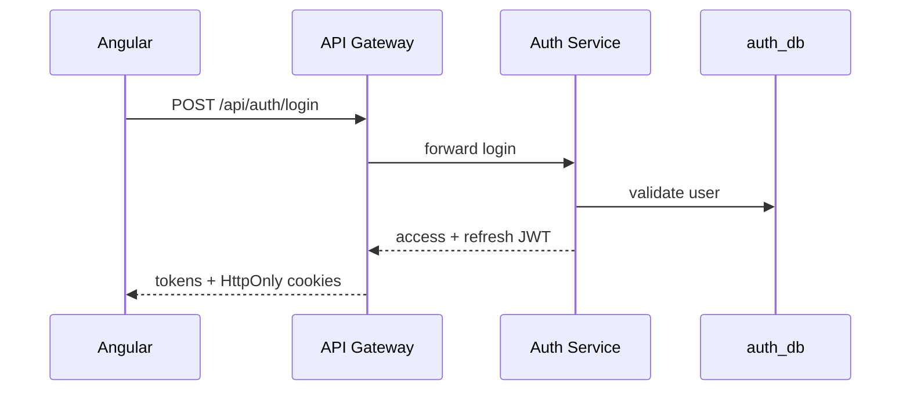
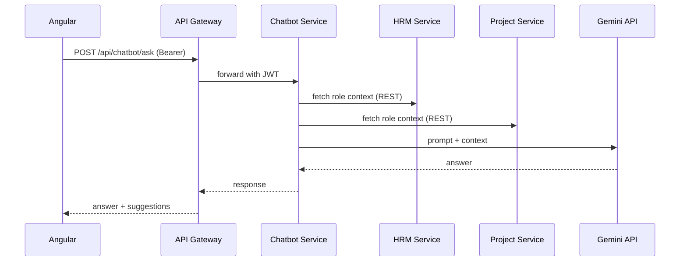
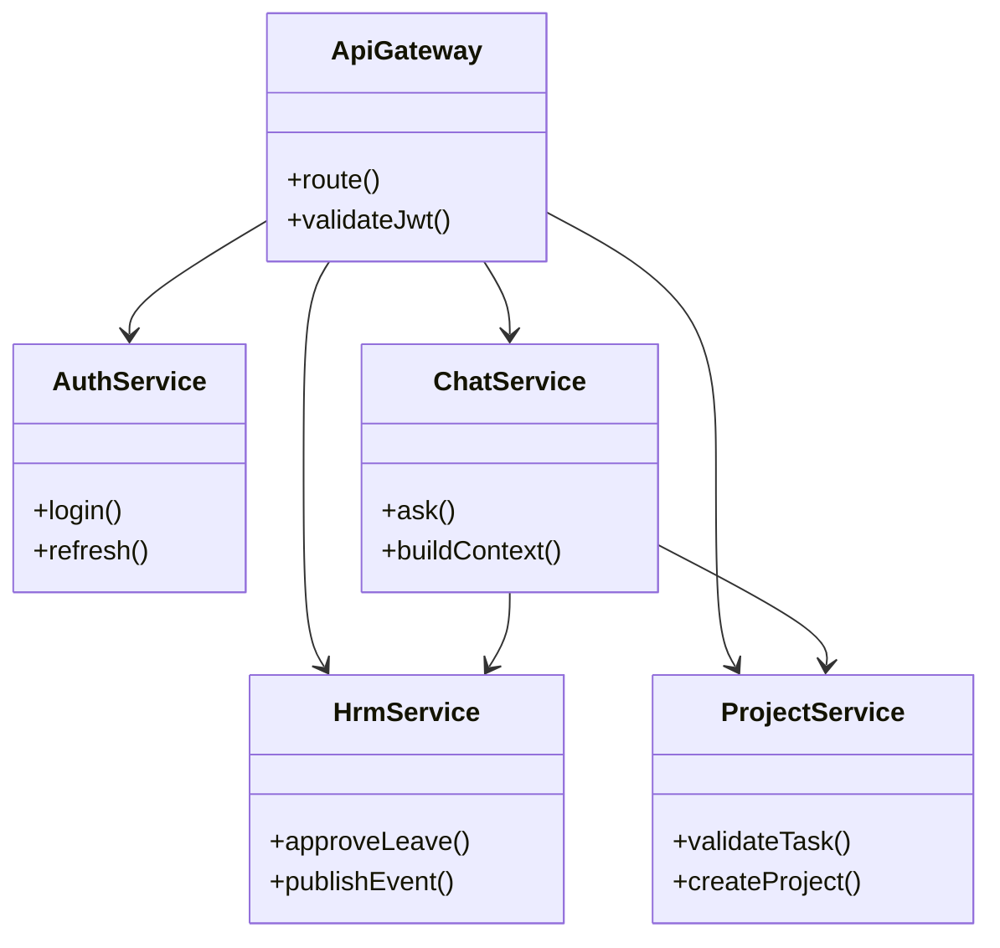

# Architecture documentation

## Use cases (summary)

| Actor | Use cases |
|-------|-----------|
| Employee | Manage tasks, request leave, view payroll/documents, chat with AI |
| Team Leader | Assign/validate tasks, monitor team, approve-related views |
| Manager | Manage projects, reports, leave approvals |
| HR | Employee lifecycle, payroll, training, skills |
| Admin | Read-only system overview |

## Sequence: Login via Gateway

## Sequence: Chatbot question

## Class diagram (simplified)

## API documentation

| Service | Swagger UI | OpenAPI JSON |
|---------|------------|--------------|
| Gateway | http://localhost:8080/swagger-ui.html | http://localhost:8080/api-docs |
| Auth | http://localhost:8081/swagger-ui.html | http://localhost:8081/api-docs |
| HRM | http://localhost:8082/swagger-ui.html | http://localhost:8082/api-docs |
| Project | http://localhost:8083/swagger-ui.html | http://localhost:8083/api-docs |
| Chatbot | http://localhost:8084/swagger-ui.html | http://localhost:8084/api-docs |
